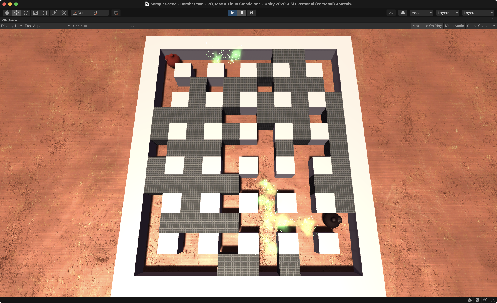
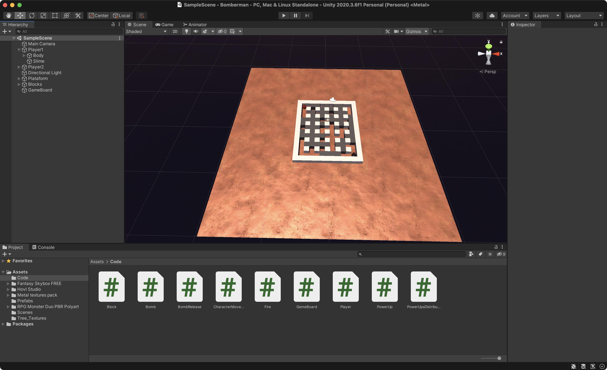
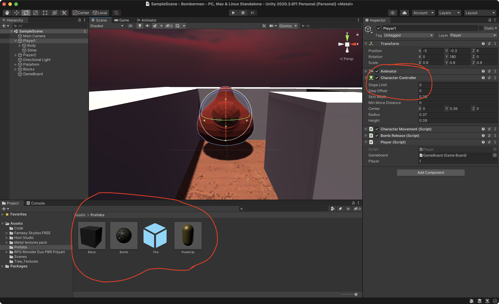
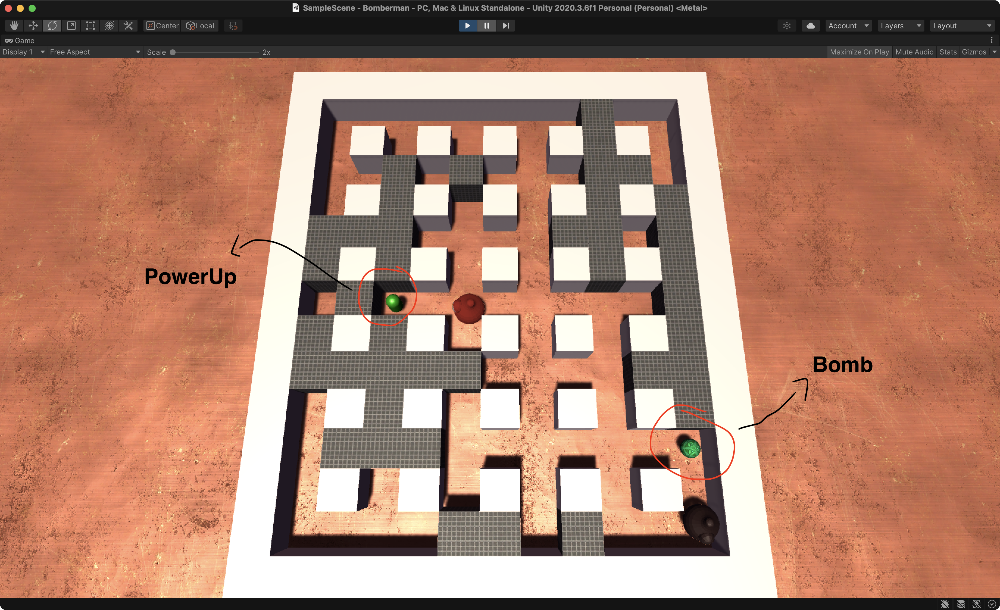

# Bomberman
Offline 2-player Bomberman built with Unity and C#

## Topics covered:
- Character Controller;
- Input Manager; 
- Collision Matrix;
- Prefabs; 
- Destroy / Instantiate GameObjects programatically; 
- Run method after delay with Invoke;
- Player Stats; 
- Using Assets from Store; 

## Solution:

Create a plane and a matrix with blocks. Use different materials to differentiate destroyable blocks:

Use a Character Controller with a custom script to handle the movement. And use Prefabs to make it easier to spawn objects:

Destroy and Instantiate GameObjects programatically:

Set a new Input Axes on Input Manger to be used for player 2:

`float horizontal = Input.GetAxis(player.player == 1 ? "Horizontal" : "HorizontalP2");`
